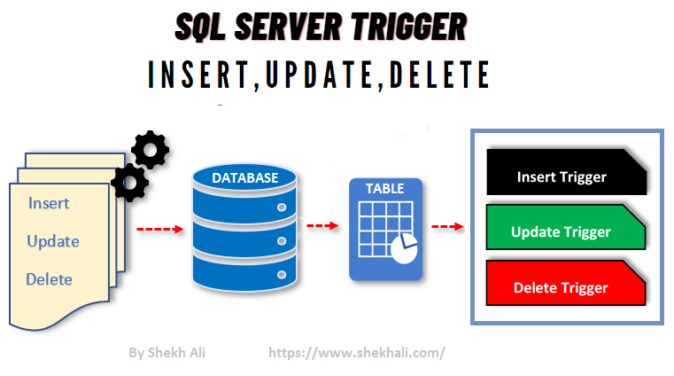

# SP_Trigger_Challenge_Team_FatemaRihamZahra

?? __**Explore & Research**__

**1. <ins>What is a Stored Procedure? </ins>** 
 
A stored procedure is a set of SQL statements that perform a specific task, stored in the database for reuse.
They can accept input parameters, return output parameters, and include programming constructs like loops and conditionals.
This allows for complex operations to be encapsulated within the database itself.

	
? <ins>Types of Stored Procedures</ins>  
 - System Stored Procedures: Provided by the database system for administrative tasks. 
 - User-Defined Stored Procedures: Custom procedures created by users to perform specific tasks.
 - Extended Stored Procedures: Allow external programs to be executed from within SQL Server.
 - CLR Stored Procedures: Written in .NET languages and integrated into SQL Server for advanced functionality
	
	
 ?<ins>Benefits of Stored Procedures:</ins>  
 

| Benefit               | Description                             |
| --------------------- | --------------------------------------- |
| **Reusability**     | Write once, use many times              |
| **Maintainability** | Logic centralized in one place          |
|  **Performance**     | Precompiled by the server               |
|  **Security**        | Fine-grained access control             |
|  **Modularity**      | Break down logic into manageable chunks |

	
? <ins>How It Works in a Database:</ins>

* Creation: You write the procedure once and store it in the database.

* Storage: The database server compiles and saves it.

* Execution: You call the procedure by name; optionally, pass in parameters.

* Reusability: It can be reused multiple times across applications.

* Security: Users can execute procedures without accessing underlying tables directly.

* Optimization: Stored procedures are parsed and optimized when created, so they often run faster than ad hoc SQL.

? <ins>Structure of a Stored Procedure:</ins>

   **1. Name** – Unique name to identify the procedure.

   **2. Parameters** – Accepts input/output parameters (optional).

   **3. Body**  – Contains SQL logic: SELECT, INSERT, UPDATE, DELETE, etc.

? <ins> Syntax:</ins>

For MySQL (other databases like SQL Server, Oracle, PostgreSQL have similar concepts with slightly different syntax):

      
       DELIMITER //

     CREATE PROCEDURE procedure_name (
    IN param1 datatype,
    OUT param2 datatype
     )
    BEGIN
    -- SQL statements
     END //

      DELIMITER ;

? <ins>Example:</ins>

Stored Procedure to Get Employee Details by Department

    DELIMITER //

     CREATE PROCEDURE GetEmployeesByDepartment (
    IN dept_id INT
     )
    BEGIN
    SELECT id, name, position FROM employees
    WHERE department_id = dept_id;
     END //

    DELIMITER ;

Call it:

      CALL GetEmployeesByDepartment(3);

 ? <ins>**Refernces of Stored Procedure**</ins>
--------------------------

1. [What is a Stored Procedure?](https://learn.microsoft.com/en-us/sql/relational-databases/stored-procedures/stored-procedures-database-engine?view=sql-server-ver17&utm.com)
2. [Types of Stored Procedures](https://www.geeksforgeeks.org/what-is-stored-procedures-in-sql/?utm.com)
3. [Types of Stored Procedures](https://learn.microsoft.com/en-us/sql/relational-databases/stored-procedures/stored-procedures-database-engine?view=sql-server-ver17&utm.com)
4. [Benefits of Stored Procedures](https://www.splunk.com/en_us/blog/learn/stored-procedures.html?utm.com)
5. [How It Works in a Databas](https://dev.mysql.com/doc/refman/8.0/en/stored-routines.html)
6. [ Structure of a Stored Procedure](https://learn.microsoft.com/en-us/sql/t-sql/statements/create-procedure-transact-sql?view=sql-server-ver17)
7. [ Syntax  ](https://docs.oracle.com/en/database/oracle/oracle-database/19/lnpls/plsql-subprograms.html)
8. [ CREATE PROCEDURE ](https://www.postgresql.org/docs/current/sql-createprocedure.html)

----------------------------------------------------------

**2. <ins>What is SQL Triggers?</ins>** 

A trigger is a stored procedure in a database that automatically invokes whenever a special
event in the database occurs. By using SQL triggers, developers can automate tasks, ensure data consistency,
and keep accurate records of database activities. For example, a trigger can be invoked when a row is
inserted into a specified table or when specific table columns are updated.

 ?  <ins>Trigger Properties:</ins>

   It is a special type of stored procedure.

It executes automatically without requiring manual invocation.

It is always associated with a specific table in the database.

It is triggered when a specific event occurs on that table, such as:

 1. INSERT (data entry)

 2. UPDATE (data modification)

 3. DELETE (data deletion)

 

	
	

