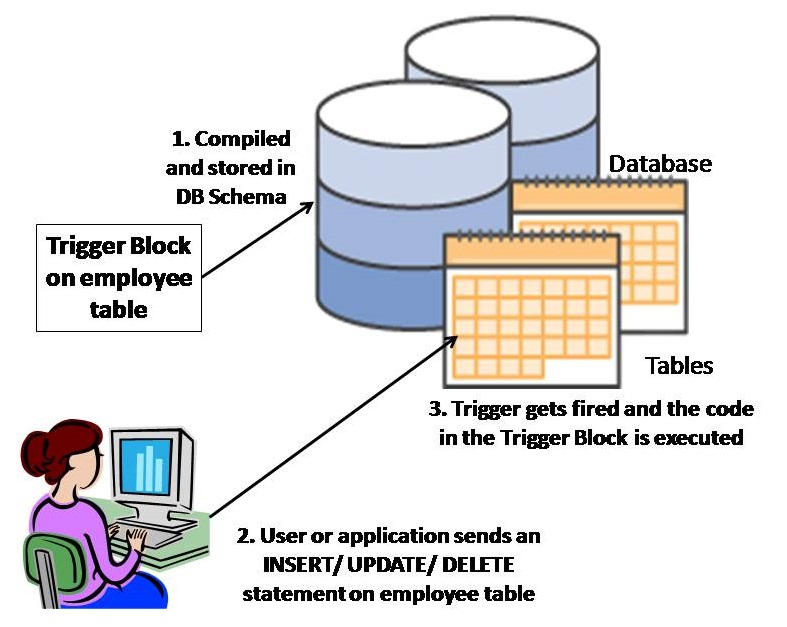

# SP_Trigger_Challenge_Team_FatemaRihamZahra

🧠 __**Explore & Research**__

**1. <ins>What is a Stored Procedure? </ins>** 
 
A stored procedure is a set of SQL statements that perform a specific task, stored in the database for reuse.
They can accept input parameters, return output parameters, and include programming constructs like loops and conditionals.
This allows for complex operations to be encapsulated within the database itself.


✅ <ins>Problems Solved by Stored Procedures:<ins>
1. Code Reusability and Consistency
Problem: Repeating the same SQL logic across multiple applications or scripts leads to code duplication and inconsistency.

Solution:
Stored procedures centralize SQL logic in one place, so it can be reused by many applications, ensuring consistent behavior.

📌 Example: A stored procedure to calculate employee bonuses used by multiple payroll apps.

2. Improved Performance
Problem: Repeated SQL queries sent from applications increase parsing and execution time.

Solution:
Stored procedures are precompiled, so they execute faster than sending SQL from applications repeatedly.

📌 Example: A procedure to batch update thousands of rows is more efficient than issuing individual SQL updates.

3. Encapsulation of Complex Logic
Problem: Writing and maintaining complex SQL logic across many applications is difficult and error-prone.

Solution:
Stored procedures allow complex business logic (loops, conditions, error handling) to be written and managed in one place.

📌 Example: Order fulfillment logic with inventory checks and payment processing.

4. Improved Security and Access Control
Problem: Giving direct access to tables risks unauthorized operations or data leaks.

Solution:
You can grant users permission to execute stored procedures without giving access to the underlying tables.

📌 Example: A user can call get_salary_info() without having direct access to the salary table.

5. Minimizing Network Traffic
Problem: Sending multiple SQL commands over a network increases latency and bandwidth usage.

Solution:
Stored procedures execute on the server, reducing the amount of data transferred between client and server.

📌 Example: A procedure that fetches and processes data before sending only final results to the client.

6. Ease of Maintenance and Updates
Problem: Changing logic in application code is time-consuming and error-prone.

Solution:
Updating a stored procedure in the database automatically applies to all clients using it.

7. Error Handling and Debugging
Problem: Handling database errors in application code can be complex and inconsistent.

Solution:
Stored procedures provide built-in exception handling to catch and respond to runtime issues.

✅ <ins>Types of Stored Procedures</ins>  
 - System Stored Procedures: Provided by the database system for administrative tasks. 
 - User-Defined Stored Procedures: Custom procedures created by users to perform specific tasks.
 - Extended Stored Procedures: Allow external programs to be executed from within SQL Server.
 - CLR Stored Procedures: Written in .NET languages and integrated into SQL Server for advanced functionality
	
	
 ✅<ins>Benefits of Stored Procedures:</ins>  
 

| Benefit               | Description                             |
| --------------------- | --------------------------------------- |
| **Reusability**     | Write once, use many times              |
| **Maintainability** | Logic centralized in one place          |
|  **Performance**     | Precompiled by the server               |
|  **Security**        | Fine-grained access control             |
|  **Modularity**      | Break down logic into manageable chunks |


	
✅ <ins>How It Works in a Database:</ins>

* Creation: You write the procedure once and store it in the database.

* Storage: The database server compiles and saves it.

* Execution: You call the procedure by name; optionally, pass in parameters.

* Reusability: It can be reused multiple times across applications.

* Security: Users can execute procedures without accessing underlying tables directly.

* Optimization: Stored procedures are parsed and optimized when created, so they often run faster than ad hoc SQL.


✅ <ins>Structure of a Stored Procedure:</ins>


   **1. Name** – Unique name to identify the procedure.

   **2. Parameters** – Accepts input/output parameters (optional).

   **3. Body**  – Contains SQL logic: SELECT, INSERT, UPDATE, DELETE, etc.

✅ <ins> Syntax:</ins>

For MySQL (other databases like SQL Server, Oracle, PostgreSQL have similar concepts with slightly different syntax):

      
       DELIMITER //

     CREATE PROCEDURE procedure_name (
    IN param1 datatype,
    OUT param2 datatype
     )
    BEGIN
    -- SQL statements
     END //

      DELIMITER ;

✅ <ins>Example:</ins>

Stored Procedure to Get Employee Details by Department

    DELIMITER //

     CREATE PROCEDURE GetEmployeesByDepartment (
    IN dept_id INT
     )
    BEGIN
    SELECT id, name, position FROM employees
    WHERE department_id = dept_id;
     END //

    DELIMITER ;

Call it:

      CALL GetEmployeesByDepartment(3);


##### ✅ <ins>**Refernces of Stored Procedure**</ins>
--------------------------

1. [What is a Stored Procedure?](https://learn.microsoft.com/en-us/sql/relational-databases/stored-procedures/stored-procedures-database-engine?view=sql-server-ver17&utm.com)
2. [Types of Stored Procedures](https://www.geeksforgeeks.org/what-is-stored-procedures-in-sql/?utm.com)
3. [Types of Stored Procedures](https://learn.microsoft.com/en-us/sql/relational-databases/stored-procedures/stored-procedures-database-engine?view=sql-server-ver17&utm.com)
4. [Benefits of Stored Procedures](https://www.splunk.com/en_us/blog/learn/stored-procedures.html?utm.com)
5. [How It Works in a Databas](https://dev.mysql.com/doc/refman/8.0/en/stored-routines.html)
6. [ Structure of a Stored Procedure](https://learn.microsoft.com/en-us/sql/t-sql/statements/create-procedure-transact-sql?view=sql-server-ver17)
7. [ Syntax  ](https://docs.oracle.com/en/database/oracle/oracle-database/19/lnpls/plsql-subprograms.html)
8. [ CREATE PROCEDURE ](https://www.postgresql.org/docs/current/sql-createprocedure.html)


----------------------------------------------------------


## **<ins>Trigger in the database</ins>** 

### <ins>What is a Trigger?</ins>

A trigger is a stored procedure in a database that automatically invokes whenever a special
event in the database occurs. By using SQL triggers, developers can automate tasks, ensure data consistency,
and keep accurate records of database activities. For example, a trigger can be invoked when a row is
inserted into a specified table or when specific table columns are updated.

### **<ins> What Kind of Problem Does a Trigger Solve in a Database?<ins>
##### Triggers solve several problems in a database, including:
**1. Ensuring Data Integrity**
- Triggers can enforce complex constraints beyond what is possible with simple CHECK or FOREIGN KEY constraints.

- Example: Prevent inserting an order if the customer’s credit limit would be exceeded.

**2. Automating System Tasks**
- Triggers automate routine system-level tasks that must happen in response to data changes.

- Example: Automatically update a last_modified timestamp whenever a row is updated.

**3. Auditing and Logging**
- Triggers can be used to track changes for auditing purposes.

- Example: Log every DELETE operation on a sensitive table into an audit table for security review.

**4. Enforcing Business Rules**
- Triggers enforce complex business logic at the database level.

- Example: Reject an INSERT into the employees table if the department budget is exceeded.

**5. Maintaining Derived or Summary Data**
- Triggers help maintain aggregated or derived data automatically.

- Example: Automatically update total sales in a summary table when a new sale is inserted.

**6. Preventing Invalid Transactions**
- You can use triggers to roll back transactions if specific conditions aren't met.

- Example: Prevent insertion of records on weekends.


 ### ✅  <ins>Trigger Properties:</ins>

- It is a special type of stored procedure.
- It executes automatically without requiring manual invocation.
- It is always associated with a specific table in the database.
- It is triggered when a specific event occurs on that table, such as:
 1. INSERT (data entry)
 2. UPDATE (data modification)
 3. DELETE (data deletion)

 

 ### <ins> Example of use trigger on specific table</ins>:
  

 
 ### ✅  <ins>Benefits of SQL Triggers</ins>

 | **Benefit**                     | **Description**                                                                      |
| ------------------------------- | ------------------------------------------------------------------------------------ |
| **Automation of Tasks**      | Executes actions automatically in response to table events (INSERT, UPDATE, DELETE). |
| **Data Integrity**           | Enforces data validation rules consistently at the database level.                   |
| **Auditing and Logging**     | Keeps a history of data changes for traceability and compliance.                     |
| **Centralized Logic**        | Business rules are stored in the database, reducing redundancy across apps.          |
| **Improved Security**        | Monitors or restricts sensitive operations (e.g., who can update or delete data).    |
| **Application Consistency**  | Ensures the same behavior across different applications accessing the database.      |
| **Reduced Code Duplication** | Minimizes logic written in applications by handling tasks at the database level.     |
| **Real-time Monitoring**     | Reacts immediately to data changes, useful for alerts or real-time dashboards.       |

### **Types of Triggers in DBMS**
1. **DDL Triggers**: 
   - Those type of triggers are activated when changes are made to the structure of the database, such as creating, changing, or deleting tables or other objects.
2. **DML Triggers**: 
   - those type of triggers are triggers are activated by changes to the data in a table.Typically, these changes are made through INSERT, UPDATE, or DELETE statements.     
3. **Logon Triggers**: 
     - These triggers are activated when a user logs into the database. These triggers are mainly used to control who can access the database or to monitor who is logging in.
<ins> Types based on their execution timing<ins>:
   - **BEFORE Trigger**: Executes before the triggering event occurs.Executes before an INSERT, UPDATE, or DELETE operation.
   - **AFTER Trigger**: Executes after the triggering event occurs. Executes after an INSERT, UPDATE, or DELETE operation.
   - **INSTEAD OF Trigger**: Executes in place of the triggering event, allowing custom logic to be applied. Executes in place of an INSERT, UPDATE, or DELETE operation.
   
### **Trigger Uses in real life appliaction**
   - A trigger could **prevent a user from deleting a record** if it is referenced by another table.
   - A trigger could **ensure that a student's grade** is always within the valid range (0 to 100) before it's inserted into the database. 
   - Triggers can help maintain data integrity by **automatically updating related tables or fields when changes occur**. For example, if a student's grade is updated, a trigger could automatically update the student's overall GPA in another table. 
   - Triggers can be used to **log changes made to the database**, such as who made the change and when it occurred. This is useful for auditing purposes and tracking changes over time. For example, a trigger could log every time a student's grade is updated, including the old and new values, the user who made the change, and the timestamp, anthor example is with a financial institution might use a trigger to log every change to a customer's account balance, including the old value, the new value, timestamp, and user ID. 
   - In an e-commerce system, a trigger could be used to automatically update the total sales when a new sale is made.

### Syntax of Trigger in SQL:
```
CREATE TRIGGER trigger_name
ON table_name
AFTER INSERT, UPDATE, DELETE
AS
BEGIN
    -- SQL statements to execute
END;

```

### Example of Trigger in SQL:
```sql  
CREATE TRIGGER trg_AfterInsert
ON Employees
AFTER INSERT
AS
BEGIN
    DECLARE @empID INT;
    SELECT @empID = inserted.EmployeeID FROM inserted;
    
    INSERT INTO AuditLog (EmployeeID, Action, ActionDate)
    VALUES (@empID, 'Inserted', GETDATE());
END;
```
### DDL Trigger Example:
```sql  
CREATE TRIGGER trg_PreventTableDrop
ON DATABASE
FOR DROP_TABLE
AS
BEGIN
    RAISERROR('Dropping tables is not allowed.', 16, 1);
    ROLLBACK;
END;
```
### DML Trigger Example:
```sql
CREATE TRIGGER trg_UpdateSalary
ON Employees
AFTER UPDATE
AS
BEGIN
    DECLARE @empID INT, @newSalary DECIMAL(10, 2);
    SELECT @empID = inserted.EmployeeID, @newSalary = inserted.Salary FROM inserted;
    
    IF @newSalary < 0
    BEGIN
        RAISERROR('Salary cannot be negative.', 16, 1);
        ROLLBACK;
    END
END;
```
### DML Trigger Example with INSTEAD OF:
```sql
CREATE TRIGGER trg_InsteadOfDelete
ON Employees
INSTEAD OF DELETE
AS
BEGIN
    DECLARE @empID INT;
    SELECT @empID = deleted.EmployeeID FROM deleted;
    
    -- Custom logic before deleting
    INSERT INTO DeletedEmployees (EmployeeID, DeletedDate)
    VALUES (@empID, GETDATE());
    
    -- Perform the actual delete
    DELETE FROM Employees WHERE EmployeeID = @empID;
END;
```
## logic of the above example:
1. **Trigger Creation**: The trigger `trg_AfterInsert` is created on the `Employees` table to execute after an insert operation.
1. **Variable Declaration**: It declares a variable `@empID` to hold the Employee ID of the newly inserted record.
1. **Data Retrieval**: It retrieves the Employee ID from the `inserted` pseudo-table, which contains the new row(s) being inserted.
1. **Audit Log Insertion**: It inserts a record into the `AuditLog` table, logging the Employee ID, action type ('Inserted'), and the current date and time.
1. **Trigger Execution**: The trigger automatically executes whenever a new row is inserted into the `Employees` table, ensuring that an audit log entry is created for each insert operation.
1. **DDL Trigger Example**: The `trg_PreventTableDrop` trigger prevents the dropping of tables in the database by raising an error and rolling back the operation.
1. **DML Trigger Example**: The `trg_UpdateSalary` trigger checks if the new salary is negative after an update operation and raises an error if it is, rolling back the transaction.
1. **INSTEAD OF Trigger Example**: The `trg_InsteadOfDelete` trigger allows custom logic to be executed before deleting a record, such as logging the deletion in a separate table before performing the actual delete operation.

### ✅ <ins>**Refernces of Triggers in SQL**</ins>
--------------------------

1. [What is SQL Triggers?](https://www.geeksforgeeks.org/sql-trigger-student-database/)
2. [Types of Triggers in DBMS](https://www.ccbp.in/blog/articles/trigger-in-dbms)
3. [Trigger Uses](https://estuary.dev/blog/database-triggers/)


✅ <ins>**Difference between stored procedures, trigger and function**</ins>

| Feature                | Stored Procedure                                      | Trigger                                               | Function                                              |
|------------------------|-------------------------------------------------------|-------------------------------------------------------|-------------------------------------------------------|
| Purpose                | Execute a set of SQL statements for specific tasks    | Automatically execute in response to table events     | Return a value or perform calculations                 |
| Execution              | Called explicitly by applications or scripts          | Automatically invoked by database events              | Called explicitly in SQL expressions or statements     |
| Invocation             | Called explicitly by name                             | Automatically invoked by database events              | Called explicitly in SQL expressions or statements     |
| Parameters             | Can accept input/output parameters                    | Cannot accept parameters                               | Can accept input parameters                            |
| Return Value           | Can return multiple result sets or output parameters  | Does not return a value                                | Must return a single value                            |
| Transaction Control    | Can include transaction control (COMMIT/ROLLBACK)    | Cannot control transactions directly                   | Cannot control transactions directly                   |
| Side Effects           | Can modify data, create tables, etc.                 | Automatically modifies data based on events            | Cannot modify database state; used for calculations    |
| Execution Context      | Executed in the context of the calling application    | Executed in the context of the database event         | Executed in the context of the calling SQL statement   |
| Use Cases              | Batch processing, complex logic, data manipulation   | Enforcing business rules, auditing, logging           | Data validation, calculations, transformations         |
| Performance            | Can be optimized for performance                      | May impact performance if not designed carefully       | Generally lightweight, used for calculations           |
| Security               | Can be secured with permissions                        | Can restrict access to sensitive operations            | Can be secured with permissions                        |
| Maintenance            | Requires explicit updates for changes                 | Automatically applies to all relevant events           | Requires updates for changes in logic                  |


	
	


