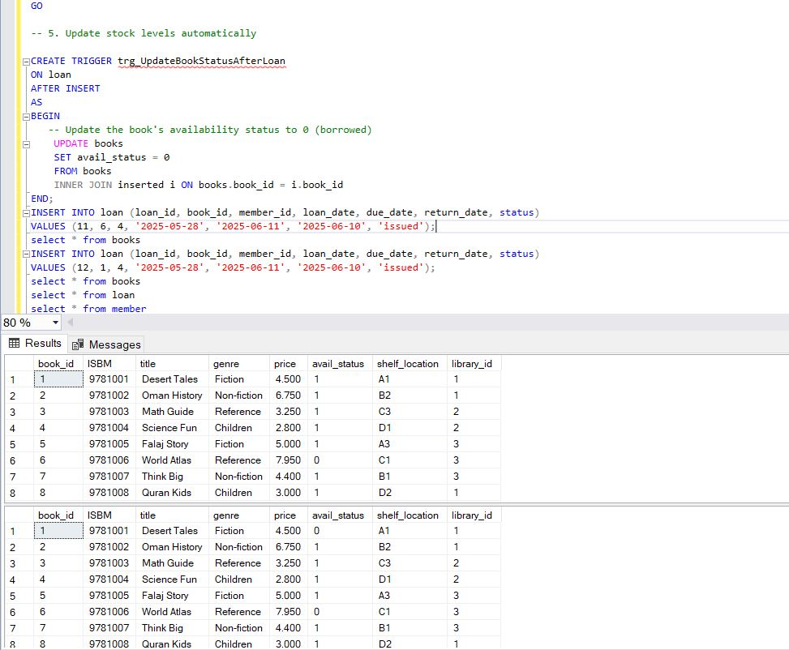
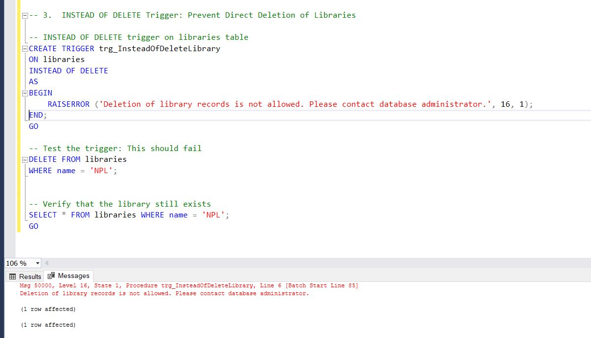

 # 🧠 Apply Trigger in Practice  
 ### AFTER INSERT Trigger: Log New Book Additions
```
Create an audit table for books
CREATE TABLE Book_Audit (
    audit_id INT PRIMARY KEY IDENTITY,
    book_id INT NOT NULL,
    title VARCHAR(20) NOT NULL,
    action_type VARCHAR(50) NOT NULL,
    action_date DATETIME DEFAULT GETDATE()
);
-- AFTER INSERT trigger on books table
CREATE TRIGGER trg_AfterInsertBook
ON books
AFTER INSERT
AS
BEGIN
    INSERT INTO Book_Audit (book_id, title, action_type)
    SELECT book_id, title, 'New Book Added'
    FROM INSERTED;
END;
-- Test the trigger
INSERT INTO books (ISBM, title, genre, price, avail_status, shelf_location, library_id)
VALUES (9781011, 'Gardening Basics', 'Non-fiction', 8.500, 1, 'B4', 2);
-- Verify the audit table
SELECT * FROM Book_Audit;
```


### BEFORE UPDATE Trigger: book avilable
```
CREATE TRIGGER trg_UpdateBookStatusAfterLoan
ON loan
AFTER INSERT
AS
BEGIN
   -- Update the book's availability status to 0 (borrowed)
    UPDATE books
    SET avail_status = 0
    FROM books
    INNER JOIN inserted i ON books.book_id = i.book_id
END;
INSERT INTO loan (loan_id, book_id, member_id, loan_date, due_date, return_date, status)
VALUES (11, 6, 4, '2025-05-28', '2025-06-11', '2025-06-10', 'issued');
select * from books
INSERT INTO loan (loan_id, book_id, member_id, loan_date, due_date, return_date, status)
VALUES (12, 1, 4, '2025-05-28', '2025-06-11', '2025-06-10', 'issued');
select * from books
select * from loan
select * from member
```


### 3.INSTEAD OF DELETE Trigger: Prevent Direct Deletion of Libraries

```
INSTEAD OF DELETE trigger on libraries table
CREATE TRIGGER trg_InsteadOfDeleteLibrary
ON libraries
INSTEAD OF DELETE
AS
BEGIN
    RAISERROR ('Deletion of library records is not allowed. Please contact database administrator.', 16, 1);
END;
GO

-- Test the trigger: This should fail
DELETE FROM libraries
WHERE name = 'NPL';


-- Verify that the library still exists
SELECT * FROM libraries WHERE name = 'NPL';
```



