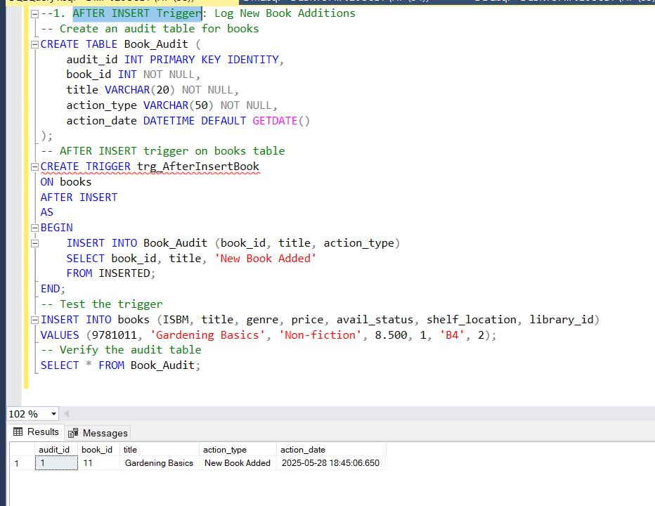

 # 🧠 Apply Trigger in Practice  
 ### AFTER INSERT Trigger: Log New Book Additions
```
Create an audit table for books
CREATE TABLE Book_Audit (
    audit_id INT PRIMARY KEY IDENTITY,
    book_id INT NOT NULL,
    title VARCHAR(20) NOT NULL,
    action_type VARCHAR(50) NOT NULL,
    action_date DATETIME DEFAULT GETDATE()
);
-- AFTER INSERT trigger on books table
CREATE TRIGGER trg_AfterInsertBook
ON books
AFTER INSERT
AS
BEGIN
    INSERT INTO Book_Audit (book_id, title, action_type)
    SELECT book_id, title, 'New Book Added'
    FROM INSERTED;
END;
-- Test the trigger
INSERT INTO books (ISBM, title, genre, price, avail_status, shelf_location, library_id)
VALUES (9781011, 'Gardening Basics', 'Non-fiction', 8.500, 1, 'B4', 2);
-- Verify the audit table
SELECT * FROM Book_Audit;
```



